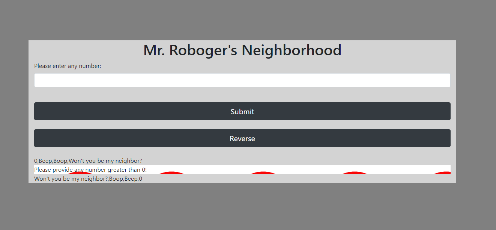

# **Mr. Roboger's Neighborhood**
By Olha Hizhytska

## Technologies Used:

* JavaScript
* HTML
* CSS
* jQuery
* Bootstrap

## Description

This application takes a number from a user and returns a range of numbers from 0 to the user inputted number (including this number) with the next exceptions:

 - Numbers that contain a 1: all digits are replaced (all digits) with "Beep!"
 - Numbers that contain a 2: all digits are replaced (all digits) with "Boop!"
 - Numbers that contain a 3: all digits are replaced (all digits) with "Won't you be my neighbor?"

 These exceptions are written from least to most important.
 A user can enter a new number and see new results over and over again.
 Button "Reverse Result" shows the output in reversed order.

 

## Setup

- Clone this repository to your desktop, using next command:

  git clone https://github.com/OlgaHi/Mr.-Roboger-s-Neighborhood.git

- Navigate to the top level of the directory.

  cd Mr.-Roboger-s-Neighborhood

- Open index.html in your browser.

## Specifications

Describe: beepBoop()

1.Test: "It should return false if NaN is inputted"
Expect: (beepBoop("a").toEqual(false);

2.Test: "It should return a string with all the digits from 0 till inputted number, including the number"
Expect: (beepBoop(5).toEqual("0,1,2,3,4,5");

3.Test: "It should return a string with a range of numbers from 0 to inputted number (including this number), with modified digits of 1,2 and 3".
Expect: (beepBoop(5).toEqual("0,Beep,Boop,Won't you be my neighbor?,4,5");

4.Test: "It should convert an array elements into individual strings".
Expect: (beepBoop(6).toEqual(["0", "1", "2", "3", "4", "5", "6"]);

5.Test: "It should return an array, modifiying value 1"
Expect: (beepBoop(1).toEqual(["0", "Beep"]);

6.Test: "It should return an array, modifiying value 1,2 and 3, taking an account prioritizing of excemptions".
Expect: (beepBoop(12).toEqual(["0", "Beep", "Boop", "Won't you be my neighbor?", "4", "5", "6", "7", "8", "9", "Beep", "Beep", "Boop"]).

Describe: reverse()

1.Test: "It should return reversed array, starting from the last element and finishing with a first element of the original array".
Expect: reverse(["0", "Beep", "Boop"]).toEqual(["Boop", "Beep", "0"]).

2.Test: "It should return alert, when a user click Reverse button, without providing the input number".
Expect: click(reverse()).toEqual("Please provide any number greater than 0!")

## Known Bugs

- No known issues

## License

[MIT](https://en.wikipedia.org/wiki/MIT_License)
Copyright (c) 2021 Olha Hizhytska

## Contact Information

- Olha Hizhytska olgainfotech@gmail.com

## Please check this application [here]()